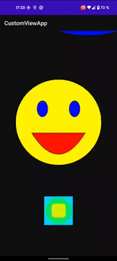

# CustomViewApp

The application is designed to be familiar with the View and its lifecycle.
In the course of work, the onMeasure and onDraw methods were overridden. ValueAnimator used for animation

